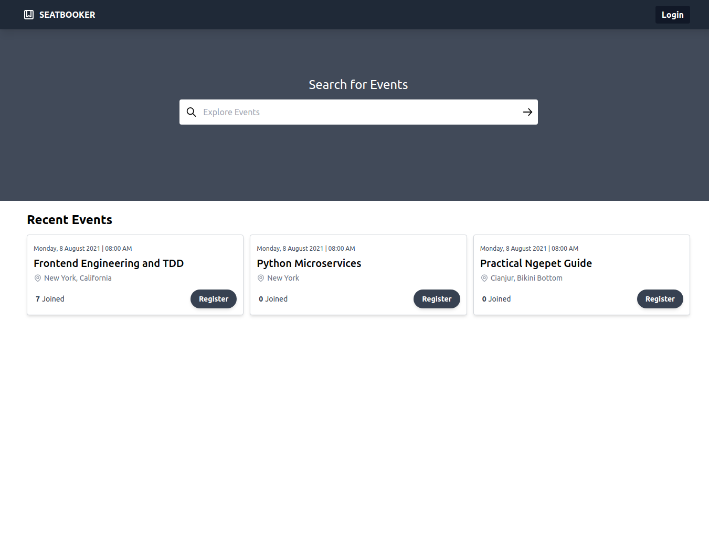
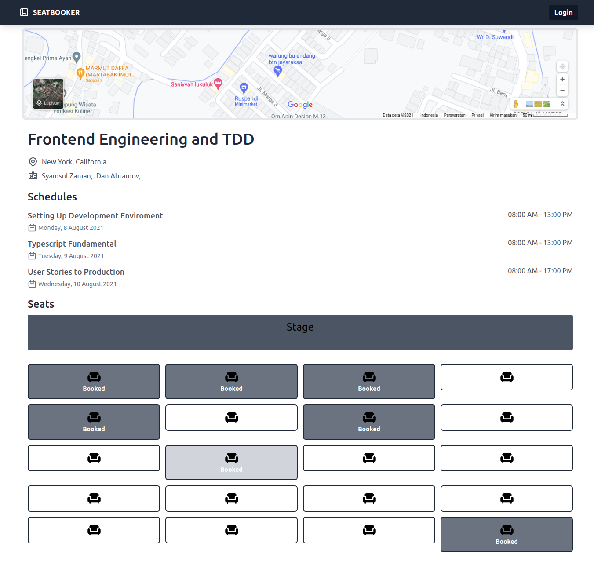
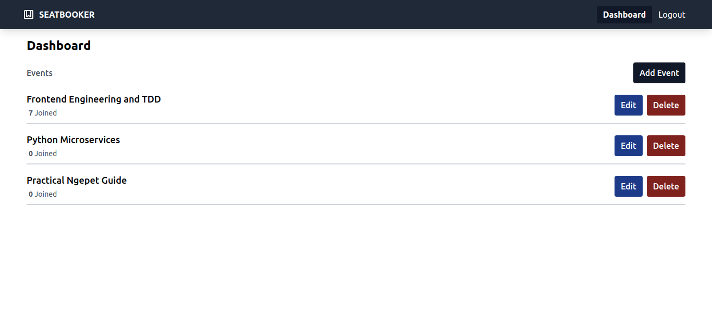
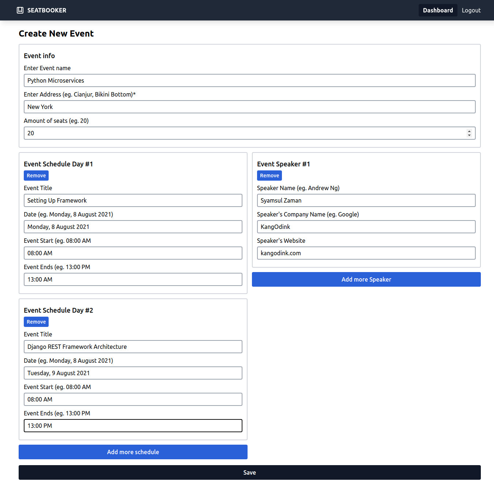

# SeatBooker
Frontend App for Managing Events and It's Seats setup. Built with React, Redux, Redux-Form, TailwindCSS, json-server

### Home

List of the available events

### Event detail

If you wanna book a Seat, be sure to click on the chair that has no "booked"
labeled to it

### User Dashboard

Whether you wanna create, edit or delete a event, this is the one to go

### Adding Event

